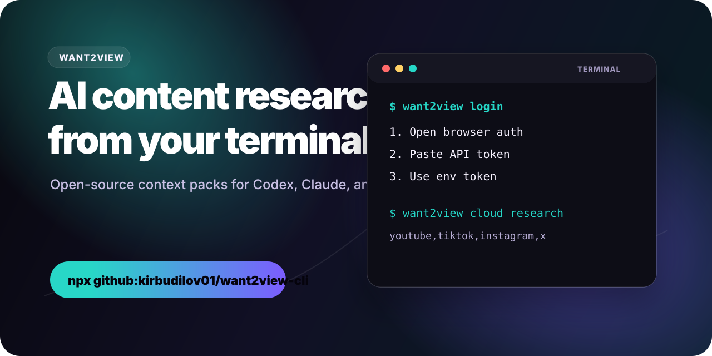
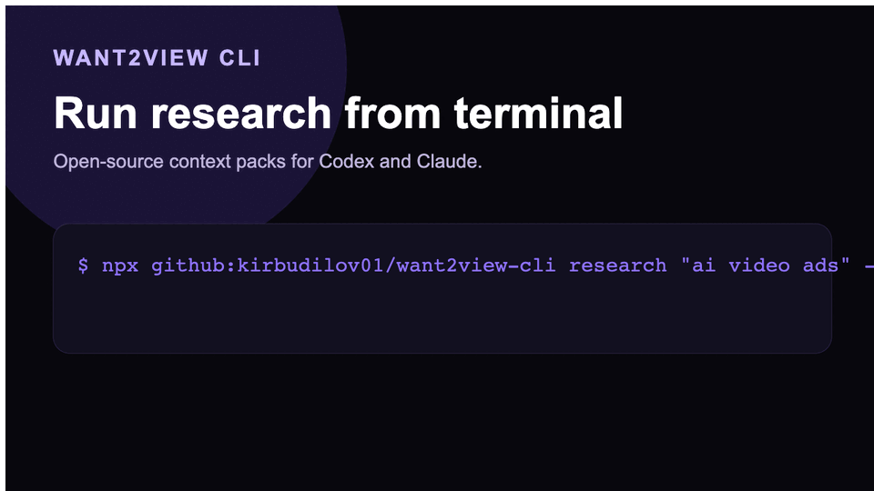
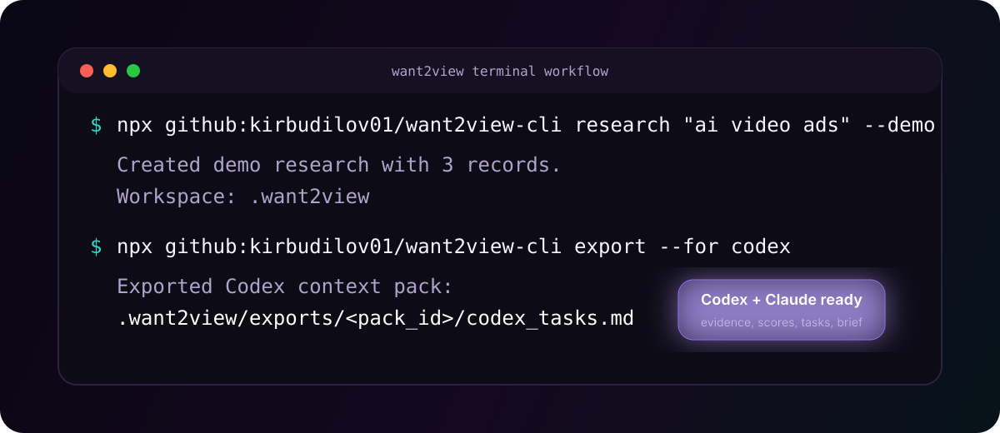
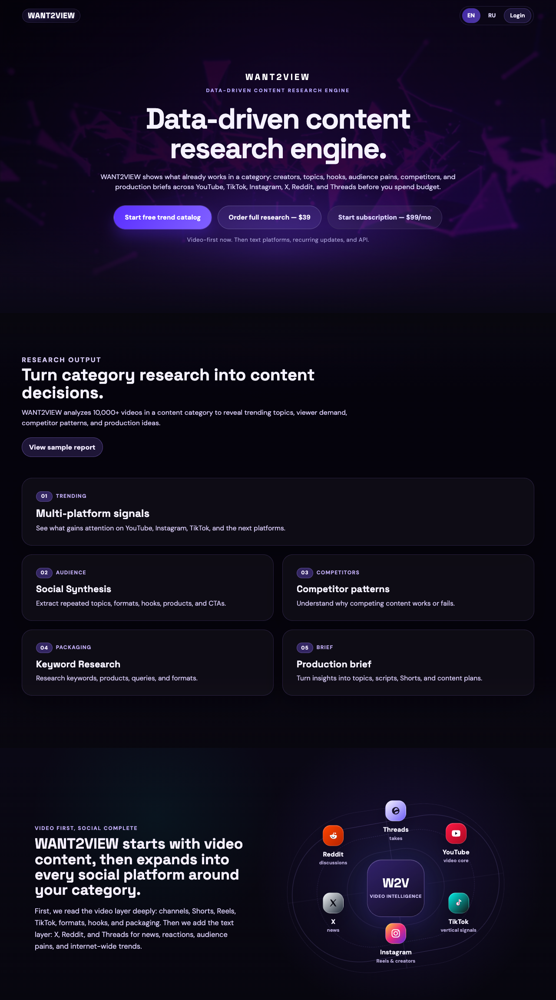
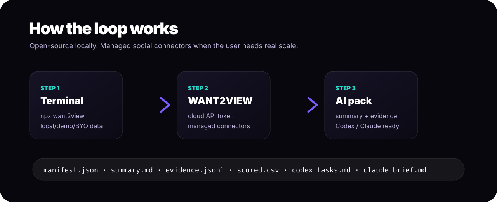

<p align="center">
  
</p>

<p align="center">
  <a href="https://github.com/kirbudilov01/want2view-cli"></a>
  <a href="https://github.com/kirbudilov01/want2view-cli/actions/workflows/ci.yml"></a>
  <a href="https://github.com/kirbudilov01/want2view-cli/releases/tag/v0.1.0"></a>
  
  
  
</p>

# WANT2VIEW CLI

Open-source content research packs for Codex, Claude, and terminal agents.

This repository is a free gift from the WANT2VIEW team: a lightweight terminal bridge that helps AI agents work with content evidence instead of guessing.

Start free from the terminal. The public catalog is intentionally limited, so anyone can try the workflow. Upgrade to WANT2VIEW Cloud when you need deeper catalog access, your own private projects, managed social connectors, scheduled refreshes, team workspaces, and production-scale content intelligence.

```bash
npx github:kirbudilov01/want2view-cli research "ai video ads" --demo
npx github:kirbudilov01/want2view-cli export --for codex
```

<p align="center">
  
</p>

<p align="center">
  
</p>

<p align="center">
  <a href="https://want2view.com">
    
  </a>
</p>

<p align="center">
  <strong>Free CLI for discovery. Full WANT2VIEW for real research operations.</strong><br />
  <a href="https://want2view.com">Website</a> ·
  <a href="https://app.want2view.com">Create account</a> ·
  <a href="https://app.want2view.com/api-access">Get API access</a>
</p>

<p align="center">
  <a href="./docs/RECIPES.md">Recipes</a> ·
  <a href="./docs/API_ACCESS_FLOW.md">API Access Flow</a> ·
  <a href="./docs/LAUNCH_PLAYBOOK.md">Launch Playbook</a> ·
  <a href="./SUPPORT.md">Support</a>
</p>

## TL;DR

WANT2VIEW CLI is the open-source doorway into WANT2VIEW.

- **Free:** local demo packs, your own CSV/JSON imports, limited public catalog samples, Codex/Claude exports.
- **Paid/account:** deeper catalog, private WANT2VIEW projects, Developer CLI tokens, managed social connectors, scheduled refreshes, custom research.
- **Best use:** give AI coding/research agents a real evidence folder instead of a vague prompt.

## What You Get In 60 Seconds

```bash
npx github:kirbudilov01/want2view-cli research "ai video ads" --demo
npx github:kirbudilov01/want2view-cli export --for codex
```

Output:

```text
.want2view/exports/<pack_id>/
  manifest.json
  summary.md
  evidence.jsonl
  scored.csv
  codex_tasks.md
  claude_brief.md
```

Then tell your agent:

```text
Use the newest .want2view/exports/<pack_id> folder as the source of truth.
Read manifest.json, summary.md, evidence.jsonl, scored.csv, and codex_tasks.md.
Base recommendations only on evidence rows.
```

## Pick Your Path

| You want to... | Run this | What happens |
| --- | --- | --- |
| Try it with zero setup | `research "ai video ads" --demo` | Creates a free local AI context pack |
| Use your own data | `import ./competitors.csv` | Converts CSV/JSON/JSONL into an evidence pack |
| Give Codex better context | `export --for codex` | Writes `codex_tasks.md`, `summary.md`, `evidence.jsonl` |
| Give Claude a strategy brief | `export --for claude` | Writes `claude_brief.md` with evidence references |
| Browse the public catalog | `catalog categories` | Shows a limited public sample of WANT2VIEW categories |
| Export public catalog evidence | `catalog export ai --for codex` | Gives an agent-readable sample pack from public catalog data |
| Use your own WANT2VIEW projects | `projects list` | Requires `WANT2VIEW_PUBLIC_API_KEY` from API Access |
| Export a project to an agent | `project export <id> --for codex` | Turns your internal project into an AI-readable pack |
| Use real social connectors | `login` then `cloud research --mode cloud` | Runs through WANT2VIEW Cloud |
| Order custom research | Open WANT2VIEW | Get a human/product-ready category research package |
| Pick a ready workflow | `recipes founder` | Shows commands, agent prompt, and WANT2VIEW next step |

## Free vs WANT2VIEW Cloud

| Layer | Open-source CLI | WANT2VIEW Cloud |
| --- | --- | --- |
| Local demo | Included | Included |
| Import your CSV/JSON/JSONL | Included | Included |
| Public catalog | Limited sample | Deeper catalog and history |
| Private projects | API client only | Full dashboard, saved projects, reports |
| Social connectors | Client interface | Managed YouTube, TikTok, Instagram, X, Reddit, Threads |
| Refreshes | Manual | Scheduled and monitored |
| Agent packs | Codex and Claude exports | Codex, Claude, API, team workflows |
| Custom research | Not included | Done-for-you reports and briefs |

## Why This Exists

Most AI agents are only as good as the context you give them. WANT2VIEW CLI turns social content evidence into clean, inspectable files that agents can use as a source of truth.

Local open-source mode gives immediate value:

- demo research;
- CSV / JSON / JSONL imports;
- basic normalization and scoring;
- Codex-ready task packs;
- Claude-ready research briefs.

WANT2VIEW Cloud adds the paid product:

- deeper catalog data beyond the public sample;
- private project exports from the WANT2VIEW dashboard;
- managed YouTube, TikTok, Instagram, X, Reddit, and Threads connectors;
- provider keys, retries, source warnings, and cost controls;
- scheduled refreshes;
- team workspaces;
- historical source index;
- hosted dashboard and API;
- custom research packages for teams that want the result done for them.

<p align="center">
  
</p>

## One-Command Demo

Run directly from GitHub before the npm package is published:

```bash
npx github:kirbudilov01/want2view-cli research "ai video ads" --demo
npx github:kirbudilov01/want2view-cli export --for codex
npx github:kirbudilov01/want2view-cli recipes founder
npx github:kirbudilov01/want2view-cli export --for claude
```

After npm publish, the same workflow becomes:

```bash
npx want2view research "ai video ads" --demo
npx want2view export --for codex
```

Package status: the `want2view` npm name is prepared for publishing, but this repository can already run through GitHub with `npx github:kirbudilov01/want2view-cli`.

## Agent Handoff

Tell Codex, Claude Code, or another terminal agent:

```text
Use the newest .want2view/exports/<pack_id> folder as the source of truth.
Read manifest.json, summary.md, evidence.jsonl, scored.csv, and codex_tasks.md.
Base recommendations only on evidence rows.
```

Generated packs contain:

```text
manifest.json
summary.md
evidence.jsonl
scored.csv
codex_tasks.md
claude_brief.md
```

More copy-paste prompts live in [docs/AGENT_PROMPTS.md](./docs/AGENT_PROMPTS.md).

## Recipes

Recipes are not separate hidden features. They are practical paths that combine the existing CLI commands with WANT2VIEW product surfaces.

| Recipe | Start with CLI | Continue in WANT2VIEW |
| --- | --- | --- |
| Agency client research | `import ./client-competitors.csv` then `export --for claude` | Order a done-for-you report or connect the client workspace |
| Founder niche check | `research "your niche" --demo` then `catalog export ai --for codex` | Unlock deeper catalog, private projects, and API access |
| Content team monitoring | `cloud research "category" --mode cloud` | Schedule refreshes and share project packs with the team |

Full copy-paste workflows live in [docs/RECIPES.md](./docs/RECIPES.md).

## Interactive Login

There are two keys because there are two product surfaces:

- `WANT2VIEW_API_TOKEN`: Developer CLI token for cloud connector runs.
- `WANT2VIEW_PUBLIC_API_KEY`: Public API key for your WANT2VIEW projects and reports.

Cloud mode needs a WANT2VIEW Developer CLI token. The login wizard gives users three paths:

```bash
npx github:kirbudilov01/want2view-cli login
```

```text
Choose authentication method:
  1. Open browser and create/paste Developer CLI token
  2. Paste API token now
  3. Use WANT2VIEW_API_TOKEN from environment
  4. Skip for now
```

Fast paths:

```bash
npx github:kirbudilov01/want2view-cli login --token w2v_your_token
export WANT2VIEW_API_TOKEN="w2v_your_token"
```

Agent diagnostics:

```bash
npx github:kirbudilov01/want2view-cli doctor --json
```

Project API:

```bash
export WANT2VIEW_PUBLIC_API_KEY="your_dashboard_api_key"
npx github:kirbudilov01/want2view-cli projects list
npx github:kirbudilov01/want2view-cli project export <project_id> --for codex
```

## WANT2VIEW Catalog

Use catalog commands to discover a limited public sample of what WANT2VIEW already tracks:

```bash
npx github:kirbudilov01/want2view-cli catalog categories
npx github:kirbudilov01/want2view-cli catalog videos ai --limit 20
npx github:kirbudilov01/want2view-cli catalog export ai --for claude
```

This is the bridge from GitHub discovery into the real WANT2VIEW product: the CLI can show public catalog surfaces, while authenticated users can export private projects, run cloud research, and unlock deeper social intelligence.

## Cloud Social Research

Once authenticated, the CLI can ask WANT2VIEW Cloud to run managed social collection:

```bash
npx github:kirbudilov01/want2view-cli cloud research "fitness reels" \
  --sources youtube,tiktok,instagram,x --mode cloud

npx github:kirbudilov01/want2view-cli cloud status w2v_run_abc123
npx github:kirbudilov01/want2view-cli cloud export w2v_run_abc123 --for codex
```

The CLI stores exported packs locally under:

```text
.want2view/exports/<run_id>/
```

## What You Can Buy From WANT2VIEW

The open-source CLI is the free entrypoint. WANT2VIEW Cloud is for serious, repeated work:

| Product | Best for |
| --- | --- |
| Managed connectors | Teams that need YouTube, TikTok, Instagram, X, Reddit, and Threads without maintaining provider access |
| API access | Agencies, AI agents, automations, and internal tools |
| Scheduled refreshes | Weekly monitoring of a niche, creator market, product category, or competitor set |
| Custom research | Done-for-you category reports, competitor maps, content briefs, scripts, and client-ready insights |
| Team workspace | Shared source-of-truth packs, saved history, and repeatable research workflows |

Start here:

- Website: [want2view.com](https://want2view.com)
- App / API token: [app.want2view.com](https://app.want2view.com)
- API Access: [app.want2view.com/api-access](https://app.want2view.com/api-access)
- Custom research: open a WANT2VIEW account and request a research package from the dashboard.

## Built For These Workflows

- Content teams researching a new category before filming.
- Agencies turning competitor data into client-ready strategy.
- Founders checking whether a niche has real content demand.
- AI agents that need evidence files before writing briefs, scripts, landing pages, or reports.
- Internal tools that need a clean bridge into WANT2VIEW data.

## Bring Your Own Data

```bash
npx github:kirbudilov01/want2view-cli import examples/competitors.csv
npx github:kirbudilov01/want2view-cli score
npx github:kirbudilov01/want2view-cli export --for claude
```

Supported local inputs:

- `.csv`
- `.json`
- `.jsonl`

Recommended columns:

| Column | Meaning |
| --- | --- |
| `platform` | YouTube, TikTok, Instagram, X, Reddit, Threads, or custom source |
| `account` | Creator, channel, author, subreddit, or profile |
| `title` | Content title or post headline |
| `url` | Source URL |
| `views` | Reach metric |
| `likes` | Likes or equivalent reaction count |
| `comments` | Comment count |
| `published_at` | Publication date |
| `text` | Caption, summary, or note |

## Command Map

| Command | Purpose |
| --- | --- |
| `want2view login` | Interactive auth wizard |
| `want2view doctor --json` | Agent-readable setup diagnostics |
| `want2view recipes` | Show agency, founder, and monitoring workflows |
| `want2view recipes founder` | Print a copy-pasteable niche-check workflow |
| `want2view catalog categories` | Browse WANT2VIEW catalog categories |
| `want2view catalog export ai --for codex` | Export catalog evidence for an agent |
| `want2view projects list` | List your WANT2VIEW projects with `WANT2VIEW_PUBLIC_API_KEY` |
| `want2view project export <id> --for codex` | Export your internal project to Codex/Claude |
| `want2view research "topic" --demo` | Free local demo pack |
| `want2view import ./file.csv` | Bring your own data |
| `want2view score` | Score local records |
| `want2view export --for codex` | Create Codex pack |
| `want2view export --for claude` | Create Claude brief |
| `want2view cloud research "topic" --mode cloud` | Start managed WANT2VIEW Cloud run |
| `want2view cloud status <run_id>` | Poll cloud run |
| `want2view cloud export <run_id> --for codex` | Download cloud context pack |

## Open Core Boundary

Open-source:

- CLI runner;
- local imports;
- demo data;
- limited public catalog access;
- normalization;
- basic scoring;
- Codex and Claude context-pack exports;
- auth wizard and cloud API client.

Paid WANT2VIEW Cloud:

- deeper catalog access;
- private project exports;
- managed platform connectors;
- approved API/bridge infrastructure;
- TikTok, Instagram, X, Reddit, Threads production collection;
- scheduled refreshes;
- team workspaces;
- deeper scoring and historical indexes;
- dashboard and API.

## Local Development

```bash
node bin/want2view.js research "ai video ads" --demo
node bin/want2view.js export --for codex
node bin/want2view.js doctor --json
```

## Links

- Website: [want2view.com](https://want2view.com)
- App: [app.want2view.com](https://app.want2view.com)
- API Access: [app.want2view.com/api-access](https://app.want2view.com/api-access)
- Repo: [github.com/kirbudilov01/want2view-cli](https://github.com/kirbudilov01/want2view-cli)
- Roadmap: [ROADMAP.md](./ROADMAP.md)
- Contributing: [CONTRIBUTING.md](./CONTRIBUTING.md)
- Security: [SECURITY.md](./SECURITY.md)
- Support: [SUPPORT.md](./SUPPORT.md)
- Agent prompts: [docs/AGENT_PROMPTS.md](./docs/AGENT_PROMPTS.md)
- Recipes: [docs/RECIPES.md](./docs/RECIPES.md)
- API access flow: [docs/API_ACCESS_FLOW.md](./docs/API_ACCESS_FLOW.md)
- Launch ideas: [docs/LAUNCH_PLAYBOOK.md](./docs/LAUNCH_PLAYBOOK.md)
