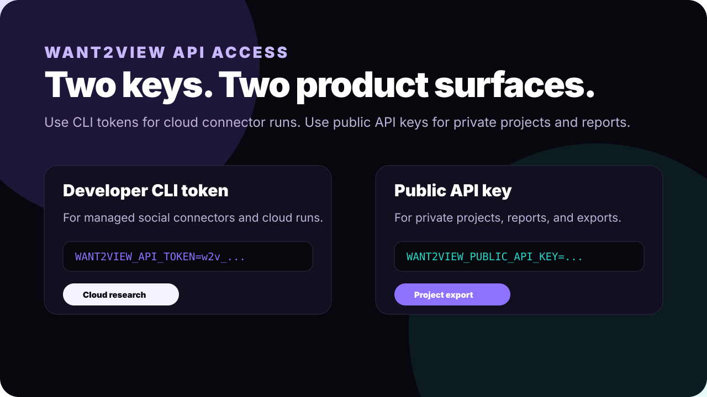

# API Access Flow

WANT2VIEW has two auth surfaces for CLI users.

## Developer CLI Token

Use this for managed cloud connector runs:

```bash
npx github:kirbudilov01/want2view-cli login
```

The CLI token is stored locally or passed through:

```bash
export WANT2VIEW_API_TOKEN="w2v_your_token"
```

Then:

```bash
npx github:kirbudilov01/want2view-cli cloud research "ai video ads" \
  --sources youtube,tiktok,instagram,x --mode cloud
```

## Public API Key

Use this for your private WANT2VIEW projects and reports:

```bash
export WANT2VIEW_PUBLIC_API_KEY="your_dashboard_api_key"
npx github:kirbudilov01/want2view-cli projects list
npx github:kirbudilov01/want2view-cli project export <project_id> --for codex
```

## Visual Guide



Get a key from:

- [app.want2view.com/api-access](https://app.want2view.com/api-access)
- [app.want2view.com](https://app.want2view.com)
